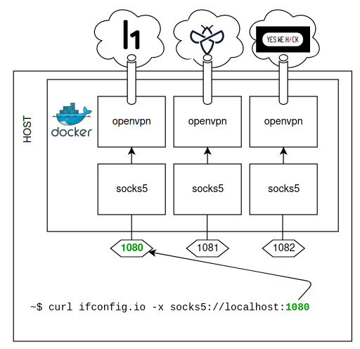
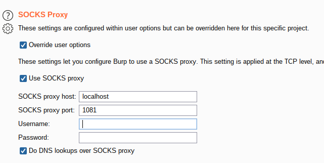

## Description

This project uses Docker to run multiple VPN tunnels simultaneously from the same machine, and exposes a SOCKS proxy for each separate VPN connection.



## Setup

1. `git clone https://github.com/honoki/bugbounty-openvpn-socks`
2. Edit the `.env` file with your platform credentials
   * **Note -** If your password or mail address contains a dollar character, you need to escape it with 3 backslashes, e.g. `pas$w0rd` becomes `pas\\\$w0rd`.
3. Download the `ovpn` files of each platform to the corresponding `/vpn/<platform>` folder:
   * Hackerone: https://hackerone.com/settings/vpn
   * Intigriti: ?
   * YesWeHack: https://yeswehack.com/user/vpn
3. `docker-compose up`
4. Check that the VPN connections are working:
  ```bash
  curl ifconfig.io # direct
  curl ifconfig.io -k -x socks5://localhost:1080; #hackerone
  curl ifconfig.io -k -x socks5://localhost:1081; #intigriti
  curl ifconfig.io -k -x socks5://localhost:1082; #yeswehack
  ```
## SOCKS5

The SOCKS5 proxy ports will be available on:
* `localhost:1080` for the Hackerone VPN;
* `localhost:1081` for the Intigriti VPN;
* `localhost:1082` for the YesWeHack VPN;

Below is a selection of tools that have SOCKS proxy support out of the box:

```bash
nuclei -proxy-socks-url socks5://localhost:1080
ffuf -x socks5://localhost:1080
curl -x socks5://localhost:1080
```

If you are using tools without built-in proxy support, you can use [`proxychains`](https://github.com/haad/proxychains) to force everything through the proxy regardless.

## Burp Suite

You can use the SOCKS proxy to tunnel Burp traffic through the VPN via "Project options":

